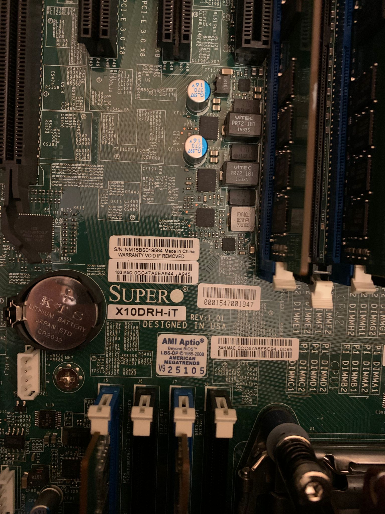
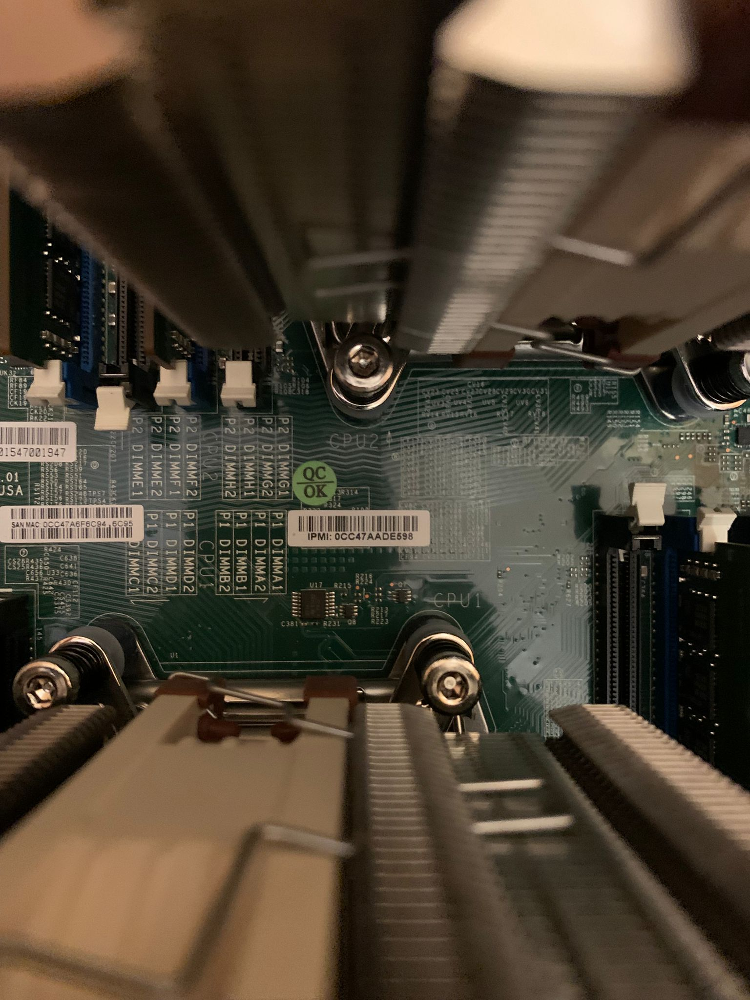

---

**Betreff: Reklamation / Gewährleistungsfall: Defekter RAM-Slot bei Motherboard Supermicro X10DRH-iT (Bestellnummer (Ebay): 07-14091-41453)**

Sehr geehrte Damen und Herren,

am 11.01.2026 habe ich bei Ihnen das Motherboard Supermicro X10DRH-iT erworben.

Leider musste ich nach einer sehr ausführlichen Fehlerdiagnose feststellen, dass der RAM-Slot **P1-DIMMD1** defekt ist. Da ich das System explizit für den Betrieb mit 8 Modulen im **Quad-Channel-Modus** gekauft habe, schränkt dieser Defekt die Speicherbandbreite und die Systemstabilität (NUMA-Symmetrie) erheblich ein.

Um Ihnen die Abwicklung zu erleichtern, habe ich ein detailliertes Fehlerprotokoll erstellt:

---

### Fehlerprotokoll: Hardware-Diagnose Supermicro X10DRH-iT

**Fehlerbild:** Das System erkennt permanent nur 7 von 8 RAM-Riegeln. Fehlermeldung im POST/BIOS: `P1-DIMMD1 Failed / Uncorrectable memory component found`.

**1. Systemkonfiguration:**

* **Mainboard:** Supermicro X10DRH-iT (Dual LGA2011-3)
* **CPUs:** 2x Intel Xeon E5-2680 v4
* **RAM:** 8x 8GB Samsung DDR4-2400 ECC RDIMM (M393A1G40EB1-CRC)

**2. Durchgeführte Tests zur Fehlerisolierung:**

| Testschritt | Maßnahme | Ergebnis | Erkenntnis |
| --- | --- | --- | --- |
| **RAM-Kreuztausch** | Riegel aus Slot `P1-DIMMD1` mit funktionierendem Riegel aus `P1-DIMMC1` getauscht. | Fehler bleibt bei **P1-DIMMD1**. | RAM-Riegel ist funktionsfähig. |
| **Anpressdruck** | Befestigungsschrauben des CPU-Kühlers (Noctua NH-D9L) gelockert und neu fixiert. | Fehler bleibt bei **P1-DIMMD1**. | Kein Montagefehler durch mechanische Spannung (Warpage). |
| **Sockel-Inspektion** | CPU 1 ausgebaut, Sockelpins unter Lupe auf Verbiegung/Verschmutzung geprüft. | Pins optisch einwandfrei, keine Unregelmäßigkeiten. | Keine mechanische Beschädigung durch den Nutzer. |
| **CPU-Kreuztausch (Swap)** | CPU 1 und CPU 2 gegeneinander getauscht (inkl. Reinigung der Kontakt-Pads). | Fehler bleibt permanent bei **P1-DIMMD1**. | **Beide CPUs sind voll funktionsfähig.** Der Defekt liegt im Mainboard-Slot oder PCB. |

**3. Finale Diagnose:**
Der Fehler ist ortsgebunden an Slot P1-DIMMD1. Da er weder mit dem RAM-Modul noch mit der CPU mitwandert, liegt ein Defekt am Mainboard vor (Speicherkanal D von CPU-Sockel 1).

---

Im Anhang finden Sie Fotos des BIOS-Screens sowie des Gesamtsystems. Hochauflösende Aufnahmen der CPU-Sockel zum Nachweis des einwandfreien Zustands der Pins lasse ich Ihnen gerne zukommen, sobald die Retoure bestätigt ist; um weitere mechanische Belastungen zu vermeiden, möchte ich das System erst unmittelbar für den Versand final demontieren.

**Seriennummer: S/N:NM15BS019584

Da ich in Deutschland ansässig bin und es sich um einen Gewährleistungsfall handelt, bitte ich um die Bereitstellung eines vorfrankierten Rücksendeetiketts (z. B. UPS, DHL oder FedEx).

Für die Zollanmeldung meiner Rücksendung werde ich das Paket als "Rückware – Defekt zur Garantie-Austausch" (HS-Code 9801 00 00) deklarieren, damit für Sie keine Einfuhrzölle anfallen.

Bezüglich des Ersatzboards: Bitte stellen Sie sicher, dass die Sendung auf der Zollrechnung deutlich als "Warranty Replacement - No Commercial Value" (Garantie-Ersatz – kein Handelswert) gekennzeichnet ist. Dies ist zwingend erforderlich, um eine Doppelbesteuerung (Einfuhrumsatzsteuer) meinerseits zu vermeiden, da die ursprünglichen Abgaben bereits beim Erstkauf entrichtet wurden.

Ich freue mich auf Ihre Anweisungen zum weiteren Vorgehen.

Darüber hinaus bin ich jederzeit unter dieser E-Mail-Adresse oder telefonisch unter +49(0)2429 2551 erreichbar; gerne können wir den Fall zur weiteren Klärung auch auf Englisch persönlich besprechen.

Das Board wird für den Rückversand fachgerecht mit Sockelschutz gesichert, antistatisch verpackt und als zerbrechliche Fracht gekennzeichnet.

Ich freue mich auf Ihre Rückmeldung zum weiteren Vorgehen.

Mit freundlichen Grüßen

Kai-Sebastian Brüll
---

