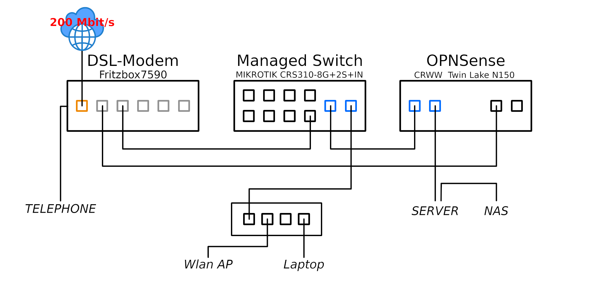

# Homelab Foundation

Documentation of the hardware and networking infrastructure for my homelab project.

## Overview

This repository documents the build process, hardware specifications, and network architecture of a dual-socket Xeon server intended for virtualization (Proxmox), Kubernetes workloads (k3s/Flatcar), and video editing.

## Server Hardware

| Component | Model | Specifications |
| --- | --- | --- |
| **Motherboard** | Supermicro X10DRH-iT | Dual LGA2011-3, E-ATX, 10GBase-T LAN |
| **CPUs** | 2x Intel Xeon E5-2680 v4 | 28 Cores / 56 Threads total, 2.40 GHz (3.30 GHz Turbo) |
| **RAM** | 64 GB DDR4 ECC Registered | 8x 8GB Samsung M393A1G40EB1-CRC, 2400MHz, Quad-Channel |
| **CPU Coolers** | 2x Noctua NH-D9L | 3U compatible, premium air cooling |
| **Case** | Inter-Tech 4U Server Chassis | 19" rackmount, black |
| **PSU** | be quiet! Pure Power 11 FM | 850W, 80 PLUS Gold, fully modular |

K8s Workload, IaC, Platform building and Video editing

## Networking

| Component | Model | Specifications |
| --- | --- | --- |
| **Firewall/Router** | CWWK N150 Mini PC | Intel N150, 2x 10GbE SFP+, 2x 2.5GbE RJ45 (i226-V), running OPNsense |
| **Switch** | MikroTik CRS310-8G+2S+IN | 8x 2.5GbE RJ45, 2x 10GbE SFP+, L3 Managed |
| **Modem** | AVM Fritzbox 7590 | DSL modem, 200 Mbit/s WAN |

## Storage (Planned)

| Component | Interface | Purpose |
| --- | --- | --- |
| SATA SSD | Onboard SATA | Proxmox Host (Boot) |
| NVMe SSD #1 | PCIe Adapter | Kubernetes Workloads (k3s/Flatcar) |
| NVMe SSD #2 | PCIe Adapter | Video Editing VM (OS/Proxy Media) |
| SATA HDD | Onboard SATA | Video Editing VM (Archive via Passthrough) |

Work in progress.
